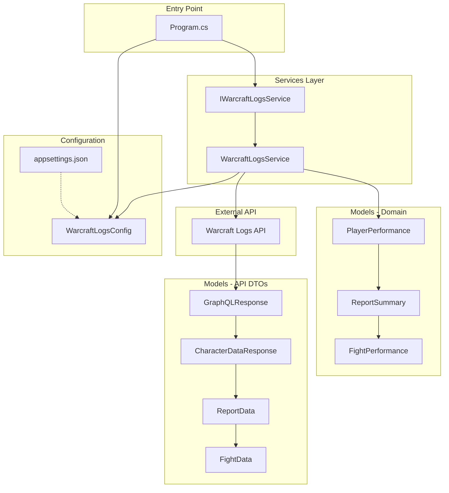

```mermaid

graph TB
    subgraph "Entry Point"
        Program[Program.cs]
    end

    subgraph "Configuration"
        AppSettings[appsettings.json]
        Config[WarcraftLogsConfig]
    end

    subgraph "Services Layer"
        Interface[IWarcraftLogsService]
        Service[WarcraftLogsService]
    end

    subgraph "External API"
        WCL[Warcraft Logs API]
    end

    subgraph "Models - Domain"
        PlayerPerf[PlayerPerformance]
        ReportSum[ReportSummary]
        FightPerf[FightPerformance]
    end

    subgraph "Models - API DTOs"
        GraphQLResp[GraphQLResponse]
        CharData[CharacterDataResponse]
        ReportData[ReportData]
        FightData[FightData]
    end

    Program --> Config
    Program --> Interface
    Interface --> Service
    Service --> Config
    Service --> WCL
    WCL --> GraphQLResp
    Service --> PlayerPerf
    GraphQLResp --> CharData
    CharData --> ReportData
    ReportData --> FightData
    PlayerPerf --> ReportSum
    ReportSum --> FightPerf
    AppSettings -.-> Config

```

    